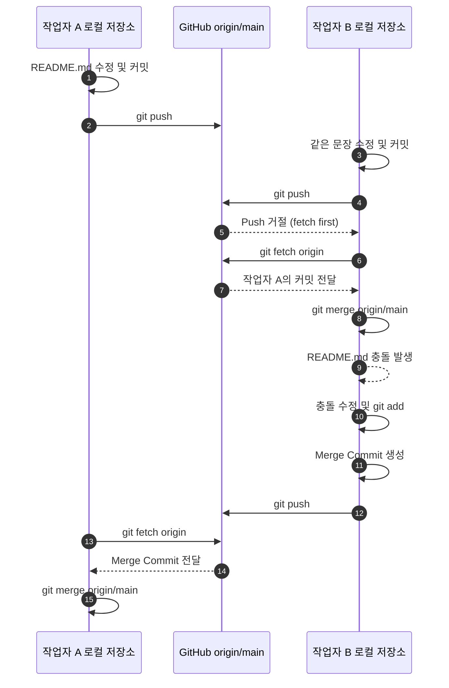

# 2026 Git Start
github 웹에서 추가한 내용입니다

오늘의 학습 목표 작업자 A-B의 Git 협업 및 merge 충돌 해결

## Fetch, Merge 및 충돌 해결 시퀀스

```mermaid
sequenceDiagram
    autonumber
    participant A as 작업자 A 로컬 저장소
    participant G as GitHub origin/main
    participant B as 작업자 B 로컬 저장소

    A->>A: README.md 수정 및 커밋
    A->>G: git push
    B->>B: 같은 문장 수정 및 커밋
    B->>G: git push
    G-->>B: Push 거절 (fetch first)
    B->>G: git fetch origin
    G-->>B: 작업자 A의 커밋 전달
    B->>B: git merge origin/main
    B-->>B: README.md 충돌 발생
    B->>B: 충돌 수정 및 git add
    B->>B: Merge Commit 생성
    B->>G: git push
    A->>G: git fetch origin
    G-->>A: Merge Commit 전달
    A->>A: git merge origin/main
```

로컬 컴퓨터에서 추가한 내용입니다.

작업자 A
작업자 B
병합
